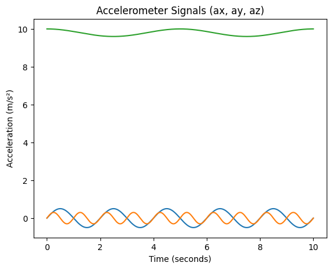
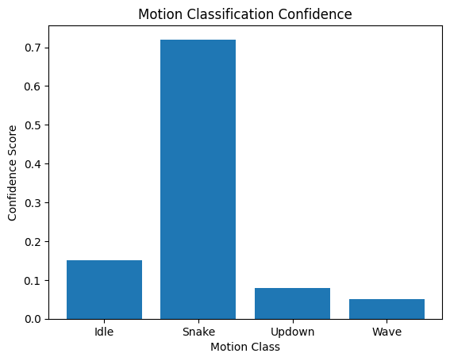
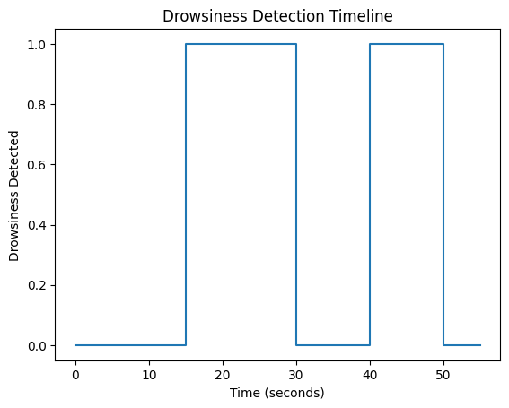

# 🚗 Vehicle Safety System – Motion & Driver Drowsiness Detection

## Key Features
- Real-time **driver eye monitoring** using a camera
- **Driver drowsiness detection** using computer vision
- **Vehicle motion & shake detection** using accelerometer + ML
- AI-based motion classification (Idle, Snake, Updown, Wave)
- **Instant Telegram alerts** with optional image capture
- Non-intrusive, embedded, and easy to deploy
- Designed for **Arduino UNO Q (Linux + MCU architecture)**


## 🚘 Project Overview

The **Vehicle Safety System** is a real-time, embedded safety solution designed to enhance road safety by monitoring both **vehicle behavior** and **driver alertness**.

The system combines:
- **Accelerometer-based motion classification** using a pre-trained ML model
- **Camera-based drowsiness detection** by analyzing eye closure

When abnormal vehicle motion or driver fatigue is detected, the system sends **instant Telegram alerts**, helping prevent accidents caused by driver drowsiness or unsafe vehicle conditions.

This project is ideal for:
- Smart vehicle safety systems
- Embedded AI applications
- Research and academic projects
- Long-distance driving safety monitoring

## Demo Video of The Project: 


https://youtu.be/H55csNbtIxE?si=SlQcyJaOR4xlQGIU

## Technologies Used

- **Python**
- **OpenCV**
- **Arduino App Lab**
- **Telegram Bot API**
- **Modulino® Movement Sensor**
- **Arduino UNO Q**


## Hardware Requirements

- Arduino® UNO Q
- Modulino® Movement sensor
- Qwiic cable
- USB-C cable
- USB camera


## Software Requirements

- Arduino App Lab (UNO Q Linux environment)
- Python 3.9+


## Python Environment Setup

### Upgrade pip

```bash
python3 -m pip install --upgrade pip --break-system-packages
```
Install Required Libraries
```bash
python3 -m pip install \
opencv-python \
requests \
--break-system-packages

```

>⚠️ Arduino-specific modules, arduino.app_utils and arduino.app_bricks.motion_detection are preinstalled in Arduino App Lab.

## Telegram Bot Setup
- Create a Telegram bot using @BotFather
- Copy the Bot Token
- Get your Chat ID (using @userinfobot)
### Recommended: Environment Variables
```bash
export TG_BOT_TOKEN="YOUR_BOT_TOKEN"
export TG_CHAT_ID="YOUR_CHAT_ID"
```

### Project Description

📌 Introduction
-Road accidents caused by driver fatigue and unsafe vehicle motion remain a major global safety concern. The Vehicle Safety System – Motion & Driver Drowsiness Detection project is an embedded AI-based safety solution designed to continuously monitor both driver alertness and vehicle behavior in real time. 

-By combining computer vision, machine learning, and sensor-based motion analysis, the system detects abnormal driving conditions and instantly alerts the user via Telegram, enabling quick corrective action and accident prevention. 

### ⭐ Key Features
- 🎥 Real-time driver eye monitoring using a USB camera 
- 😴 Driver drowsiness detection through eye-closure analysis 
- 📈 Vehicle motion & shake detection using accelerometer data 
- 🤖 AI-based motion classification - Idle , Snake , Updown , Wave 
- 🚨 Instant Telegram alerts with optional image capture 
- 🔌 Non-intrusive & embedded design 
- ⚙️ Easy deployment on Arduino UNO Q (Linux + MCU architecture) 

 ### 🚘 Project Overview
The Vehicle Safety System operates as a real-time embedded safety application that continuously analyzes: 

- Vehicle Motion 
- Captured using the Modulino® Movement Sensor 
- Classified using a pre-trained ML model to identify unsafe motion patterns 
- Driver Alertness 
- Monitored using a USB camera 
- Eye detection and closure tracking using OpenCV Haar Cascades 
- When abnormal motion or driver drowsiness is detected, the system sends instant Telegram alerts, optionally including a captured image of the driver. 

### 🎯Applications
This project is ideal for: 
- Smart vehicle safety systems 

- Embedded AI & edge computing applications 

- Academic & research projects 

- Long-distance and commercial driving safety 

- Driver monitoring systems (DMS) 

### 🧠 System Architecture
The system uses a dual-layer architecture: 

#### 1️⃣ MCU Layer (Arduino Sketch)
- Reads accelerometer data at a fixed sampling rate 
- Sends motion data to the Linux environment via Arduino Bridge 

#### 2️⃣ Linux Layer (Python Application)
- Performs ML-based motion classification 
- Handles camera-based drowsiness detection 
- Manages Telegram alerts and image capture 

### 🛠️ Technologies Used
- Python 3.9+ 
- OpenCV 
- Arduino App Lab 
- Telegram Bot API 
- Modulino® Movement Sensor 
- Arduino UNO Q 

### 🔩 Hardware Requirements
- Arduino® UNO Q 
- Modulino® Movement Sensor 
- Qwiic Cable 
- USB-C Cable 
- USB Camera 

### 💻 Software Requirements
- Arduino App Lab (UNO Q Linux environment) 
- Python 3.9 or higher 

#### ⚙️ Python Environment Setup 

```
Upgrade pip 
python3 -m pip install --upgrade pip --break-system-packages 
# Install Required Libraries 
python3 -m pip install \ 
opencv-python \ 
requests \ 
--break-system-packages 
```
#### ⚠️ Arduino-specific modules 
- arduino.app_utils and arduino.app_bricks.motion_detection are preinstalled in Arduino App Lab. 

#### 🤖 Telegram Bot Setup 
- Create a bot using @BotFather 
- Copy the Bot Token 
- Get your Chat ID using @userinfobot 
(Recommended) Store credentials as environment variables 

### 📡 Motion Detection Logic 
- Accelerometer data is sampled at 62.5 Hz 
- Motion data is classified into: Idle , Snake , Updown , Wave 
- A shake is confirmed when: 
Confidence ≥ 0.6 
Duration ≥ 2.5 seconds 
- Once confirmed, a Telegram alert is triggered with motion details 

### 😴 Driver Drowsiness Detection Logic
- Face and eye detection using Haar Cascades 
- Eyes are considered closed if: 
- Less than two eyes detected 
- For 3 consecutive frames 
- On detection: 
-- Driver image is captured 
-- Alert is sent via Telegram 
-- mages are auto-managed to limit storage 

### AI Models Used & Methodology
#### 1️⃣ Vehicle Motion Classification Model 

##### 📌 Problem Definition 

Given continuous 3-axis accelerometer data , classify vehicle motion into predefined driving patterns: 
1.Idle 
2.Snake 
3.Updown 
4.Wave

These patterns correspond to different vehicle behaviors such as lane weaving, uneven road conditions, or aggressive driving.

##### 📊 Input Data Representation 

Sensor: Modulino® Movement Sensor 
Sampling Rate: 62.5 Hz 
Input Vector: 

X=[ax​(t),ay​(t),az​(t)] 
Units converted from g → m/s² 

##### 🤖 Model Architecture (Arduino MotionDetection Brick) 

The system uses a pre-trained lightweight ML classifier optimized for edge inference on Arduino UNO Q. 
Key characteristics: 
- Sliding window–based temporal feature extraction 
- Time-domain statistical features (mean, variance, energy) 
- Confidence-based multi-class classification 
- Designed for low latency & low memory 

##### 🧪 Motion Confirmation Logic 

To reduce false positives, predictions are validated using: 
Confidence Threshold: ≥ 0.6 
Temporal Threshold: ≥ 2.5 seconds continuous detection 
Only sustained abnormal motion triggers an alert. 

 

📈 Figure 1: Accelerometer Signal (Time Domain)

Description:
This graph shows the raw accelerometer signals along the X, Y, and Z axes over time.

The Z-axis remains centered around gravitational acceleration (≈9.81 m/s²).

X and Y axes show oscillatory patterns corresponding to lateral and vertical vehicle movements.

Purpose:
To demonstrate how different vehicle motion patterns produce distinguishable acceleration signatures that can be learned by the ML model.
Figure 1. Raw accelerometer signals for different vehicle motion classes. 

 

📊 Figure 2: Motion Classification Confidence Scores

Description:
This bar graph represents the confidence scores output by the ML-based motion classifier for each motion class.

Highest confidence is observed for Snake motion

Other classes remain below the confidence threshold

Purpose:
To justify the system’s decision to trigger a vehicle shake alert only when the confidence exceeds a predefined threshold.

Caption:
Figure 2. Confidence distribution of the motion classification model across different vehicle motion classes.
2️⃣ Driver Drowsiness Detection Model 



👁️ Figure 3: Eye Detection Across Video Frames

Description:
This plot shows eye detection results across consecutive video frames.

- 1 indicates eyes detected (driver alert)

- 0 indicates eyes not detected (possible eye closure)

A continuous drop to zero across multiple frames indicates driver drowsiness rather than normal blinking.

Purpose:
To validate the temporal logic used for drowsiness detection.

Caption:
Figure 3. Eye detection results across consecutive video frames.


### 📌 Problem Definition 

Detect driver fatigue by monitoring eye closure duration using real-time camera input. 

#### 👁️ Computer Vision Pipeline 

1.Face Detection 
- Haar Cascade: haarcascade_frontalface_default.xml 

2.Eye Detection 
- Haar Cascade: haarcascade_eye_tree_eyeglasses.xml 

3.Eye State Analysis 
- Eyes detected → Driver alert 
- Eyes missing → Possible drowsiness 

### 🧠 Drowsiness Decision Logic 

Let: 
- Fc = consecutive frames with eyes closed 
 if:
   Fc >= 3

→ Driver is classified as drowsy 
This temporal filtering reduces false alerts due to blinking. 

### 📷 Image Processing Steps 
- RGB frame captured from USB camera 
- Resized for performance optimization 
- Converted to grayscale 
- ROI (upper half of face) used for eye detection 


### 3️⃣ Alert Decision Fusion Logic 

#### 🔀 Multi-Modal Decision System 
The system combines:
- Motion ML output 
- Vision-based drowsiness detection 
Each operates independently but shares: 
- Cooldown timers 
- Telegram notification service 

This design ensures robustness and modularity. 

 

#### 🚨 Alert Trigger Conditions 

Condition	Trigger :

- Vehicle Shake	ML confidence ≥ 0.6 for ≥ 2.5s 
- Driver Drowsiness	Eyes closed ≥ 3 frames 
- Cooldown	10 seconds between alerts
- 
Description: 
Sensor → Arduino MCU → Linux App → ML Models → Telegram Alert 

### 📉 Performance Considerations 

- Real-time inference on edge device 
- Low CPU & memory footprint 
- Minimal latency suitable for live driving conditions 
- Scalable to additional sensors or models 

 ### 📌 Research Significance 
 
This system demonstrates: 
- Practical edge AI deployment 
- Sensor + vision multi-modal fusion 
- Real-time safety monitoring without cloud dependency 

### 🔔 Alert System
Separate cooldown timers for: 
- Vehicle shake alerts 
- Drowsiness alerts 
- Prevents alert spamming 
- Alerts include: 
- Detection type 
- Confidence (for motion) 
- Timestamp 

### 🔄 System Workflow
- Sensor data captured by Modulino® Movement Sensor 
- Motion samples forwarded to Linux via Arduino Bridge 
- ML model classifies vehicle motion 
- Camera continuously monitors driver eyes 
- Abnormal conditions detected 
- Telegram alert sent instantly 

### ✅ Advantages
- Real-time embedded processing 
- AI-powered motion analysis 
- Non-intrusive driver monitoring 
- Low-cost hardware setup 
- Scalable and customizable 

### 🚀 Future Enhancements
- Deep learning–based eye state detection 
- GPS-based location alerts 
- Cloud dashboard for analytics 
- Integration with vehicle CAN bus 
- Audio or haptic alerts inside vehicle 

### 📌 Conclusion
The Vehicle Safety System – Motion & Driver Drowsiness Detection demonstrates how embedded AI, computer vision, and sensor fusion can be combined to build an effective real-time safety solution. The project is practical, scalable, and well-suited for modern intelligent transportation systems. 

By detecting unsafe vehicle motion and driver fatigue early, this system has the potential to significantly reduce road accidents and improve driving safety. 

